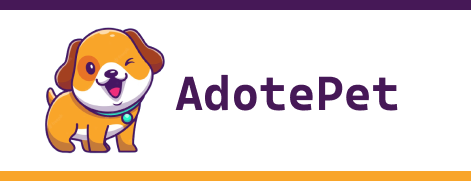

<p align="center">

</p>

## 💻 Sobre

Projeto feito para estudo da tecnologia Node.js com Express.js e React.js. O projeto consiste na criação de uma API fornecida pelo Express, com um CRUD de usuários e animais para adoção e gravando os dados no MongoDB.

Todas as rotas são consumidas pelo React.js com o Axios, para o fornecimento das telas da aplicação.

---

## 🚀 Tecnologias

O projeto foi desenvolvido com as seguintes tecnologias:

#### **Backend**

- **[Node.js](https://nodejs.org/en)**
- **[Express.js](https://expressjs.com/pt-br/)**
- **[Javascript](https://developer.mozilla.org/en-US/docs/Web/javascript)**
- **[MongoDB](https://www.mongodb.com/docs)**

#### **Frontend**

- **[React.js](https://react.dev)**
- **[Axios](https://axios-http.com)**
- **[CSS](https://developer.mozilla.org/en-US/docs/Web/CSS)**

---

## ⚙️ Como utilizar!

Siga os seguintes passos para poder utilizar a aplicação em sua máquina.

1.  Instale o Node.js e o npm seguindo os passos de [como instalar o Node.js](https://www.alura.com.br/artigos/como-instalar-node-js-windows-linux-macos?gclid=Cj0KCQjw8e-gBhD0ARIsAJiDsaWE_qDmxNRmyO4ENv-eHItJj9o7Ew4BrW84u7VUM8PC7SdECy474aAaAj_JEALw_wcB)

2.  Clone a aplicação em sua máquina local com os seguintes comandos:

```
git clone https://github.com/danvieira97/adotePet.git
```

3. Depois, vá até o diretório do seu projeto utilizando o comando

```bash
cd adotePet
```

4. [Crie uma conta no MongoDB Atlas](https://account.mongodb.com/account/login?_ga=2.142716021.1781132435.1679533368-484709700.1679533368) e adicione suas variáveis de ambiente em arquivo `.env` dentro da pasta raiz da pasta `backend`, depois da criação do cluster adicione a url dentro da pasta `backend/db/conn.js`

```env
DB_USER=seu-usuario
DB_PASS=sua-senha
```

5. Instale as dependências do projeto via `npm`:

```bash
cd ./backend && npm install
cd ./frontend && npm install
```

6. Execute os comandos para iniciar a aplicação local no seu terminal

```bash
cd ./backend && npm start
```

7. Execute os comandos para iniciar a aplicação local no seu browser e navegue até [conexão local](http://localhost:3000)

```bash
cd ./frontend && npm start
```
